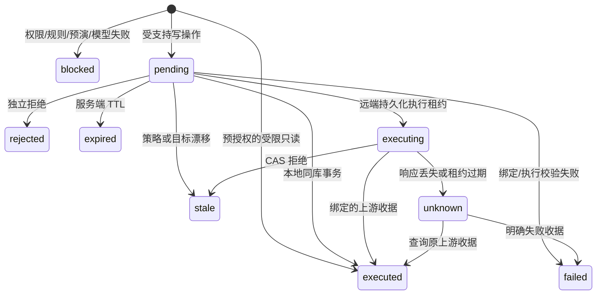

# AIRLOCK 运行与扩展契约（2026-10-02）

当前版本是个人研究项目：FastAPI、SQLite、Next.js 16.3.8 / React 19.3.0、真实 cel-python。支持固定合成 customers 数据和显式注册、实现 CAS/收据契约的 HTTP / stateless MCP JSON 上游。真实模型为可选项；不配置时可运行完整确定性审批演示。

## 启动和角色

```sh
python -m pip install -r requirements-dev.txt
npm ci
npm run build
python -m airlock init
python -m airlock serve
```

`init` 的输出和本机配置均属于凭据；按现有 CLI 指引在本地使用，不上传。默认监听 `127.0.0.1:8000`。浏览器输入 reviewer 凭据；Agent 只得到 `AIRLOCK_AGENT_TOKEN`。刷新页面需重新登录，凭据只存在内存。合成数据不是生产备份；整个开发 shell 不属于敌对 Agent 沙箱。要验证旁路隔离，运行 `python scripts/docker_smoke.py --output evidence/<独立目录>`，使用 Compose 的隔离 Agent 容器。

```sh
python scripts/demo_agent.py --scenario delete --wait 330
python scripts/demo_comparison.py --output evidence/comparison.json
python -m airlock.mcp
```

模拟器只提交和查询；由另一个浏览器中的 reviewer 决定。拒绝后模拟器真实执行安全 SELECT。`demo_comparison.py` 对两个一次性合成数据库比较裸删除、pending、拒绝、安全替代和明确批准，reviewer 是测试驱动，不是真人实验。

## 状态与事务



本地业务变化、终态、恢复依据、预算结算和 HMAC 事件在同一写事务提交。远端先持久化执行声明，后调用上游；失联保存 unknown，保留预算预占，查询原收据，不重发执行。远端信任适配器履行版本 CAS 和幂等契约，未宣称分布式 exactly-once。服务端持久化时钟高水位；超过 1 秒回退时拒绝继续处理，修复系统时钟后重查，不能延长旧批准。

## API

所有 `/v1` API 使用 Bearer 身份；Agent 和 reviewer 不互换。错误不回显原始输入。

| 路径 | 身份 | 数据和语义 |
|---|---|---|
| `POST /v1/actions` | Agent | `tool, sql, parameters, arguments, idempotency_key`；本地 tool 默认 sql，上游不能混入 SQL |
| `GET /v1/actions/{id}` | 本人 Agent / 有范围的 reviewer | Agent 仅回执；reviewer 获原快照及绑定摘要 |
| `POST /v1/actions/{id}/decision` | 有范围的 reviewer | `decision, review_digest, expected_version, reason, confirmation, visible_ms` |
| `POST /v1/actions/{id}/reconcile` | 本人 Agent | 查询原远端收据；不重新执行 |
| `GET /v1/actions?state=pending` | reviewer | 服务器先权限/状态过滤，再游标分页 |
| `GET /v1/tools` | Agent | 当前身份允许发现的注册工具 |
| `GET /v1/groups` | reviewer | 成员、累计单位、group digest、确认短语 |
| `POST /v1/groups/decision` | reviewer | 精确成员列表、组摘要、决定、依据、确认；逐成员收据 |
| `GET /v1/audit`, `/v1/events`, `/v1/metrics` | reviewer | 按当前权限过滤；SSE 不授予权限 |
| `POST /v1/policy/reload` | operator | 操作者更改本地 YAML 后显式激活；失败保留原策略 |
| `GET /v1/governance/suggestions` | operator | shadow 建议和现有版本 |
| `POST /v1/governance/activate`, `/revoke` | operator | candidate_digest、expected_version、expires_at、reason |

operator 使用部署拥有者的原 `AIRLOCK_REVIEWER_TOKEN`；自定义 reviewer 不可复用它或占用 reviewer:owner 名称。默认未配置路由时 owner 兼任 reviewer。`/v1/audit/verify` 仅默认 owner 配置可用，自定义 reviewer 无全库链验证权限；操作者可离线调用 Store.verify_audit。

## 策略与路由

设 `AIRLOCK_POLICY_FILE` 指向 `policies/example.yaml`。YAML 安全加载且拒绝重复键、alias、anchor，32 KiB/32 规则上限。CEL 由 cel-python 0.4.0 解析和运行，不是 eval。只开放 `tool/resource/principal/operation` 字符串和 `changed_rows/matched_rows` 整数，布尔、同型比较、括号、!、&&、||。每表达式 512 字符、180 AST 子树、深度 60；不支持调用、宏、算术、列表和对象访问。错误/unknown 阻断，block 优先，所有支持写操作至少 need_approval。示例和测试只证明这个子集，不代表 Envoy 变量环境/函数或策略语义兼容。

`AIRLOCK_REVIEWER_FILE` 是部署拥有者控制的 JSON，例如：

```json
{"reviewers":[
  {"id":"reviewer:sql","credential_env":"AIRLOCK_REVIEWER_SQL","tools":["sql","restore"],"resources":["customers"],"risks":["high","critical","low","blocked"],"active":true},
  {"id":"reviewer:counter","credential_env":"AIRLOCK_REVIEWER_COUNTER","tools":["upstream:counter"],"resources":["synthetic:counter"],"risks":["high","critical"],"active":true}
]}
```

这些环境变量必须是独立的至少 32 字符 ASCII 秘密。配置文件不放令牌。队列、详情、决定和审计每次检查当前 active 与范围；撤销即时生效；缺失路由阻断。用本地原子替换配置文件避免半写文件，异常期间 fail-closed。

## 上游适配

启动合成目标：`python scripts/fixture_upstream.py --port 8123 --database var/counter.sqlite`，先在其独立运行环境设置 `AIRLOCK_UPSTREAM_TEST_TOKEN`。AIRLOCK 操作者设置相同专用上游秘密及 `AIRLOCK_UPSTREAM_FILE`：

```json
{"tools":[{"name":"upstream:counter","resource":"synthetic:counter","url":"http://127.0.0.1:8123","credential_env":"AIRLOCK_UPSTREAM_TEST_TOKEN","allow_loopback":true,"arguments":{"delta":"integer"},"principals":["agent:demo"]}]}
```

只支持 literal IP origin；公网强制 HTTPS，证书必须对该 IP 有效；loopback HTTP 需显式 opt-in，仅作测试。拒绝 DNS 名称、私网/link-local、URL 用户信息/路径/query/fragment、重定向。Agent 不能新增 URL 或命令；入站令牌不透传，上游专用凭据不下发给 MCP 进程。注册上限 16，参数 16/4 KiB，响应 16 KiB，有限连接/读取/总时限。生产第三方域名/OAuth/任意 MCP 上游还未实现；注册的 stateless JSON MCP 上游已支持，不冒称零配置或通用透明代理。

上游 `POST /preview` 接收 arguments，返回 target_version、impact_units、summary、before、after；必须无副作用。`POST /execute` 接收 action_id、request_hash、expected_version、arguments，原子 CAS 与持久化幂等收据；`GET /receipts/{id}` 返回绑定 action_id/request_hash 的 executed/stale/failed 与 result。测试进程故意在提交后断连接，验证 unknown 后重启对账只发生一次效果。

HTTP 与 stdio MCP 共用 Gate。MCP 协商 2025-06-18/2025-11-25，暴露 SQL、状态及注册工具。实现回执/查询；没有 Tasks capability。`POST /mcp` 提供无会话 Streamable HTTP JSON；GET/DELETE 返回 405，不提供服务端主动 SSE。普通客户需改连接配置；同步业务调用需适配 pending/轮询；已有上游需实现本契约。官方 SDK 测试不等于所有 host 认证。

## 恢复、预算、学习

本地成功写入保存完整合成 before snapshot 和 before/after 指纹；补偿用 `tool=restore, sql=<原 action_id>` 新建动作，先在独立克隆演练，再独立批准。后续变化导致 stale；不同申请人不能读取或恢复别人的动作。backup_age 没有外部备份证据时为 null；本地补偿能力不代表真实灾备、业务可逆或远端恢复能力。

风险预算单位为 `max(matched_rows,changed_rows,1)`，按主体/资源/固定时间窗原子预占，成功结算，明确未执行时释放，unknown 保留。`AIRLOCK_BUDGET_UNITS` 默认 10000，`AIRLOCK_BUDGET_WINDOW` 默认 86400。固定窗边缘可跨窗，预算不是滑动事故概率界限，也不提供任何批准权。模型、恢复和剩余预算都不能免审写入。

组按主体、工具、资源、策略、风险、reviewer 路由及默认 60 秒窗口划分。批准绑定可见成员列表和累计确认；逐成员原子执行，一个成员的写入可能使另一个 stale，UI 如实列回执。历史 3 次明确批准只生成扩大显示分组窗口至 120 秒的 shadow 建议；operator 显式激活，最多一天、版本 CAS、可撤回。不会生成授权规则或自动降级高危请求。

## 真实模型的运行前提

只有本项目明确授权的 provider/model/key/预算齐备后才运行。实现支持 OpenAI 与 DeepSeek 各自的 Responses 接口（`store=false`、strict JSON schema）。OpenAI 只读取专用 `AIRLOCK_LLM_API_KEY`；DeepSeek 只读取 `DEEPSEEK_API_KEY`，配置与本次真实实验证据见后文。配置 `AIRLOCK_SEMANTIC_FILE` 必须包含 authorized_project=AIRLOCK、model、budget_usd、max_calls、max_concurrent、max_output_tokens、输入/缓存输入/输出单价、price_source、price_effective_date、cache_seconds。字段定义见 `airlock/semantic.py:ProviderConfig`，不在示例中编造当前商业价格。

无配置为确定性模式；启用后 schema/超时/限流/预算/usage 异常 fail-closed，模型只能加严建议。调用次数和并发有硬限制；USD/CNY 门槛是基于操作者单价和输入字节预占的保守本地估算，不是供应商账单硬封顶，需另设供应商项目预算。失败保留预占，持久化 ledger 防止重启清零。缓存键含主体、参数、模型/提示/策略/快照，应用命中与 provider cached_tokens 分开。

```sh
python -m benchmark.ablation --split dev --tuning --provider-config <已授权配置> --ledger var/research-ledger --output evidence/ablation-live.json
python scripts/live_agent.py --provider-config <已授权配置> --ledger var/agent-ledger --key <固定键> --goal <合成任务目标> --output evidence/live-agent.json
```

真实 Agent 工具集固定为计数、申请单行更新、查询、停止；最多 8 步、每轮最多一个写申请，无 reviewer 工具。出现传输异常必须先查原动作或保持原键，不启动新写入。未授权时不运行；离线契约测试不计真实模型。

## 评测和真人研究

```sh
python -m benchmark.generate
python -m benchmark.evaluate --split dev --tuning --output evidence/benchmark-dev.json
python -m benchmark.evaluate --split test --output evidence/benchmark-test.json
python -m benchmark.ablation --split test --output evidence/ablation.json
python scripts/measure_latency.py --samples 60 --output evidence/latency.json
python -m benchmark.research --output evidence/labels.json corpus <cases.jsonl> --annotations <两人独立标注.jsonl> --freeze <新版本manifest.json>
python -m benchmark.research --output evidence/study.json study <匿名导出.json> <另一个匿名导出.json>
```

旧 200 条/40 族只作合成回归，dev120/test80，作者已见过全部族，不能称盲测。新来源 Case/Annotation 的 schema、真实来源版本、业务意图、风险/可逆性、独立影响依据、快照、family/split 和未知值见 `benchmark/research.py`。导入器拒绝跨 split 同族或完全重复请求/意图；完全语义近重复仍需研究者审查。标注身份与独立性需真人研究者验证；κ 在仲裁前计算并保留分歧，不能由模型生成标签代替。

打开 `/assets/study.html`，导入 `benchmark/study-example.json` 可验证流程。真实实验需研究者提供业务授权金标、匿名招募和足够样本；示例只用于工具演练。参与者按编号 hash 交叉分配 A/B、每题只出现一次；A 展示意图+命令，B 增加 diff。首次可见后用单调时钟计时，后台暂停，手动导出。导出未签名可被修改，不能作授权或身份凭证；automation 记录明确排除。默认没有真人数据，报告 n=0、指标 null，不能推出 5 秒、90% 正确或日均 <20。

## 故障与数据保留

pending：不执行，查原动作；stale：新意图重新预演审批；clock_regression：修复系统时钟；unknown：只查询原上游收据；审计失败：本地事务不提交，远端可能已发生效果，重启对账。策略/路由文件损坏时修复受信配置，不关闭鉴权。

每库上限 10000 动作和固定合成数据上限 5000 行；当前无在线清理/归档 API。恢复快照、原 SQL 和审计均为敏感服务端数据，只授予实际所需 reviewer 权限。数据库备份需保持一致性并保留全部旧验证密钥和离线校验记录；操作者触发的 key-id 轮换在同一事务记录事件并激活，无需清空审计链；当前支持独立签名检查点与独立 S3 Object Lock 归档连接器；真实长期归档仍需部署，见 `CLOSURE_RUNBOOK.md`。数据库和 provider ledger 不进 Git；导出仅限合成证据。


## 本轮新增配置与复验入口

审批台首次启动前执行 `npm ci && npm run build`。Docker 多阶段构建自动完成 Next.js 静态导出。未构建时首页明确返回 503；没有关闭 CSP 的隐式开发回退。前端原生浏览器检查包括真实过期、漂移、执行失败、远端丢回执、长文本和脚本注入。

策略激活内容存入 SQLite `meta.active_policy`。所有本地和远端的入队/决定在同一写事务内同步版本；文件编辑本身不会激活。跨进程重载测试使用真正独立 Python 进程；重启保留已激活内容。

MCP 上游配置设置 `transport=mcp_json`、`mcp_path=/mcp`、`mcp_tools={"preview":"counter_preview","execute":"counter_execute","receipt":"counter_receipt"}`。只接受无会话 JSON、固定注册工具与明确 CAS/收据；初始化、发现、调用、协议绑定和错误全部校验。需要会话/SSE 的已注册上游可使用 `mcp_streamable`，见 `CLOSURE_RUNBOOK.md`；动态任意工具仍阻断。入站 `/mcp` 每次独立鉴权，Accept 必须含 application/json 和 text/event-stream。

远端补偿注册第二个工具，设置 `compensates=upstream:counter` 和 `arguments={"source_action_id":"string"}`，同时保持原工具的 origin、resource、专用 credential_env。原动作必须属于申请人且已确认为 executed；unknown 先对账。补偿仍经过新预演、风险预算、路由、快照绑定、独立审批和上游 CAS。合成 counter 只有当前版本仍为原执行后的版本才可恢复，后续变更不覆盖。

DeepSeek 配置示例 `configs/deepseek-flash.example.json` 使用官方 `deepseek-flash`（DeepSeek-V4.1-Flash），只读 `DEEPSEEK_API_KEY`，固定 `https://api.deepseek.com/responses`，非思考模式、strict JSON schema、store=false。2026-10-02 官方高峰价格为每百万输入未命中 ¥2、命中 ¥0.04、输出 ¥8；示例用高峰价保守估算，实际空闲时段价格可能更低。费用按 usage 计价，与实际扣费账单分别标记。用户本轮授权按所有实验共用累计 ¥3 实施，最大 650 次、并发 4；全部实验复用 `var/deepseek-continuation-ledger`，不得通过换 ledger 重置预算。失败调用保留预占，未知 usage 不填 0。

```sh
python scripts/live_validation.py --provider-config configs/deepseek-flash.example.json --ledger var/deepseek-continuation-ledger --output evidence/live
python -m benchmark.ablation --split test --workers 4 --provider-config configs/deepseek-flash.example.json --ledger var/deepseek-continuation-ledger --output evidence/ablation-live-test.json
```

`POST /v1/semantic/cache/invalidate` 为 operator-only，清除应用结果缓存并记录失效数量；供应商 prompt cache 与此不同。无环境凭据不默认进行付费调用。以上命令只在项目获得明确预算后运行。

审计轮换配置 `AIRLOCK_AUDIT_KEY_FILE` 指向 `{"keys":{"v2":"AIRLOCK_AUDIT_KEY_V2"}}`，新环境变量需独立 32 字符以上秘密。所有旧验证密钥必须保留，不能复用 key-id 替换内容。`POST /v1/audit/keys/v2/rotate` 把轮换事件和活动 key-id 原子提交，其他进程立即按新 key-id 签名；旧记录按旧 key-id 验证。默认 legacy key 兼容历史链。

`GET /v1/audit/checkpoint` 输出带数据库实例 ID、seq、链头、key-id 和签名的检查点。`scripts/audit_checkpoint.py` 将它以独占新建方式保存；操作者应把目的地放在服务端无写权限的位置。`AIRLOCK_AUDIT_ANCHOR_FILE` 指向独立保留后回送的检查点，验证器检测检查点之前的删除/插入/替换/排序/截尾。检查点之后的尾部和服务器全部密钥失陷仍存在边界。没有声称本机普通文件是 WORM。`GET /v1/audit/completeness` 另查逐状态字段与原始快照完整率，明确不适用字段；它不代替验签。

可选 `AIRLOCK_OTLP_URL=https://<literal-public-IP>/v1/traces`；仅测试时允许 loopback HTTP 并设 `AIRLOCK_OTLP_ALLOW_LOOPBACK=1`。审计事务同时入有界 1000 span outbox，满时记录丢弃数。operator 调用 `POST /v1/observability/export`，每次最多 100 span，失败保留、确定性 span ID、at-least-once。SQL、参数、凭据和模型输出不写遥测；没有把动态输入作指标标签。可用外部定时执行器调度此端点，服务本身不默认联网后台导出。`container_integrations.py` 用官方 Collector 0.162.0 与 Envoy 1.39.1 真实容器复验；Envoy 仅有限布尔/比较表达式的显式变量映射，不是完整策略语义/生产授权兼容。

身份、域名绑定、独立归档、受保护上游网络、运维告警与研究验收完整入口见 [CLOSURE_RUNBOOK.md](CLOSURE_RUNBOOK.md)。
