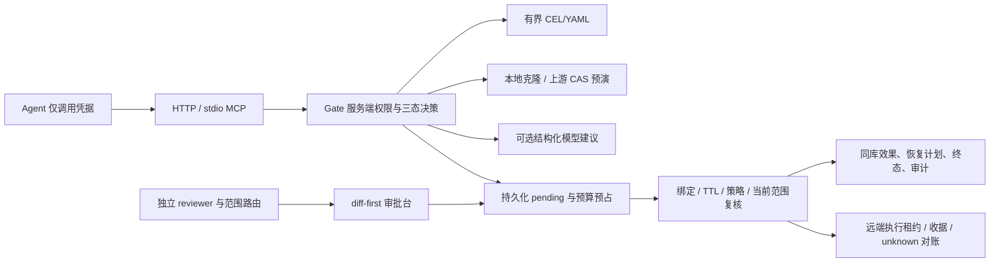

# AIRLOCK：全面审查后的设计与执行范围

个人项目的完整原目标保存在 CODEX_FULL_AUDIT_BRIEF.md 和 acceptance/AIRLOCK-acceptance-targets.json，共 126 条，包含父子项；初始 BASELINE_MATRIX.json 保持改动前状态，COMPLETION_MATRIX 单独记录逐项结果。旧 MVP 边界没有删除原目标。

## 架构

C1 支持一个明确契约的注册 HTTP 上游，MCP 客户端需适配异步回执。C2 使用真实 cel-python 的受限类型子集。C3 本地精确预演和上游声明值分开。C4 本地补偿为新审批。C5 实现真实 provider 可选路径，live 验证需本项目授权。C6 持久化、reviewer 路由、TTL/时钟回退、并发与远端未知。C7 原生界面与 A/B 工具。C8 分组、成员摘要、预算、shadow 建议。C9 结构化回执与有界模拟/真实 Agent 驱动。C10 原始快照 HMAC，不含外部锚定。C11 原始退出码、反例与 CI 产物门禁。C12 固定标签关联指标、阶段时延和真实 usage 字段，缺值为 null。

## 执行纪律和未关闭边界

先保留改动前失败与完整目标，再修 P1，增量补功能，独立反例复验，代码冻结后记录 tested_commit_sha，最后提交报告/证据并更新 memory/progress。任何未授权效果视为架构失败；不能为了满足数字放开硬拒绝、预演或审核要求。

四条原则：fail-closed；服务端持有执行权；代理行为可关联和核查；未知影响/恢复不伪装成精确事实。真实模型、人类、真实日志、独立金标与生产第三方适配缺失单列。技术栈保持 FastAPI＋原生 JS，与原 Next.js 要求的偏差未关闭；迁移不混入安全修复。

详细接口、配置、安全限制、测试/研究运行方法见 [OPERATIONS.md](OPERATIONS.md)。最终结论只由 [126 项矩阵](acceptance/COMPLETION_MATRIX.md) 及绑定提交的证据支持；父项通过不能代替子项。
