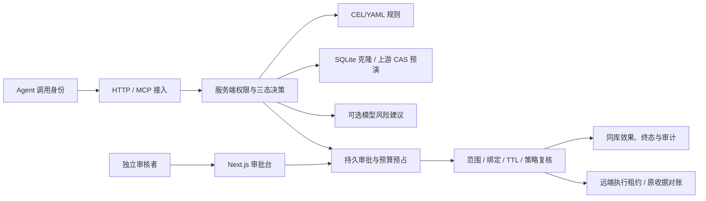

# AIRLOCK 开发计划

AIRLOCK 为 Agent 工具调用提供服务端审批边界。当前主场景是受控数据修改与仓库维护：操作提交后先计算影响，由独立审核者确认，再执行绑定的请求并保留结果与审计。

## 架构与现状

本地效果、动作状态与审计使用同一 SQLite 事务。受控 HTTP/MCP 工具依赖注册的 CAS、幂等与结果查询契约；GitHub 适配器限定固定仓库的 Issue 创建。远端 `unknown` 通过原动作对账，不盲目重发。补偿是新的独立审批。

前端使用 Next.js / React 静态导出，由 FastAPI 同源提供；影响和审计组件保留转义渲染。OIDC 主体映射已有路由，签名检查点可连接 S3 Object Lock；长期身份、云保管和外部通知尚需实际环境验证。

## 交付顺序

| 顺序 | 工作 | 完成依据 |
|---|---|---|
| 1 | 安装、启动与配置可诊断 | 新环境能按文档启动；错误配置在启动前受控失败；已有配置和数据保持完整 |
| 2 | 一条工具调用形成完整业务闭环 | 只读、pending、拒绝、批准、过期、重复与 unknown 分别有实际效果和审计证据 |
| 3 | 提升维护和使用体验 | 待办与审计可定位、失败可恢复、诊断不泄露凭据；原生浏览器和服务端回归通过 |
| 4 | 按具体任务扩展适配器 | 先定义影响、授权、幂等、收据和恢复契约，再加入隔离测试；没有契约时阻断 |
| 5 | 验证外部部署与研究指标 | 使用获授权的身份、保管、通知、真实任务和独立参与者；数据或环境缺失单列受阻 |

优先修复影响使用和安全的可复现问题。每次功能改动需要正向流程、错误边界及与风险相称的测试；复验记录命令、真实退出码、源码 SHA 和证据位置。文档和工程快照分别保存，不以清单长度衡量功能价值。

## 持续约束

- 服务端持有执行权；Agent 不获得目标数据库、审核凭据、宿主控制权或任意 Shell 入口。
- 请求、策略、影响快照和有效期必须绑定到最终执行；所有支持写入保持独立批准下限。
- 预演、模型、授权、收据或恢复依据未知时，保持阻断或明确的 unknown；预算与建议不赋予权限。
- 保留原始审批快照、失败证据和历史变更，不覆盖未提交工作，不重写仓库历史。

完整原目标位于 [CODEX_FULL_AUDIT_BRIEF.md](CODEX_FULL_AUDIT_BRIEF.md) 和 [126 项索引](acceptance/AIRLOCK-acceptance-targets.json)。[逐项矩阵](acceptance/COMPLETION_MATRIX.md)继续保存全部目标、父子记录、原阈值和未完成项；交付优先级不改变这些验收标准。
